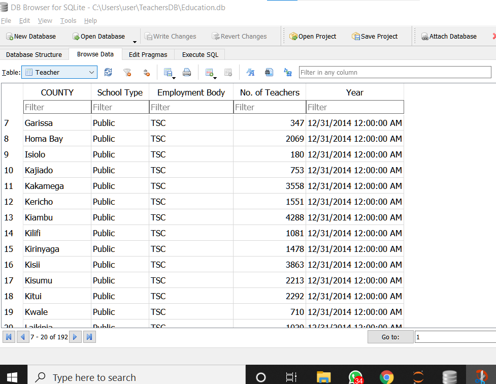
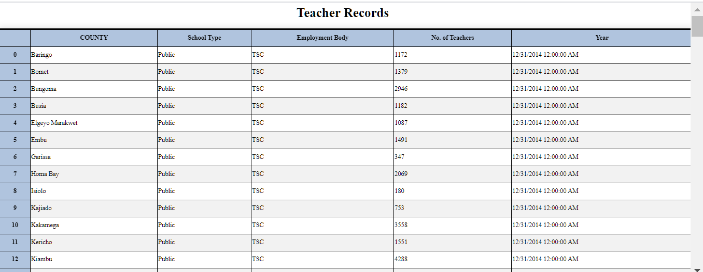

# EducationDB
## Using Pandas and SQlite
A project that ingests a CSV datafile, stores it in a SQLite database and displays output in a browser.
## How to run the project
- Load data from the csv file provided (should be in the same directory)
- Create a dataframe containing data to be entered in the sqlite database.
### Below is a graphical illustration of the database

- Display the data on a web browser as shown:        

#### A step by step procedure on how the program works is provided in the jupyter notebook.
